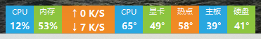
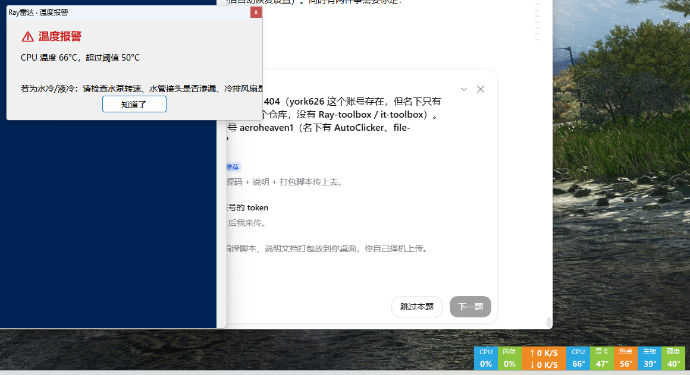
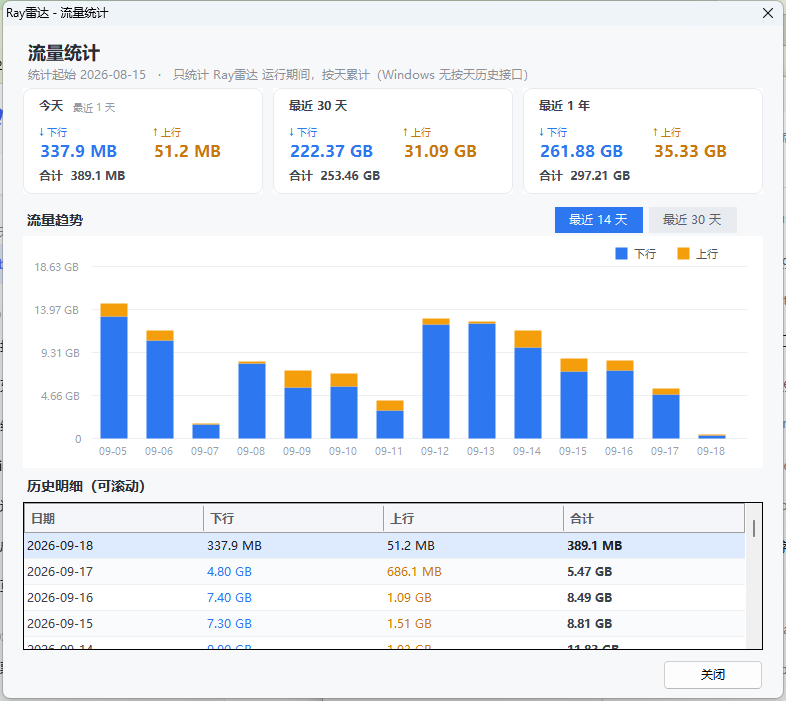
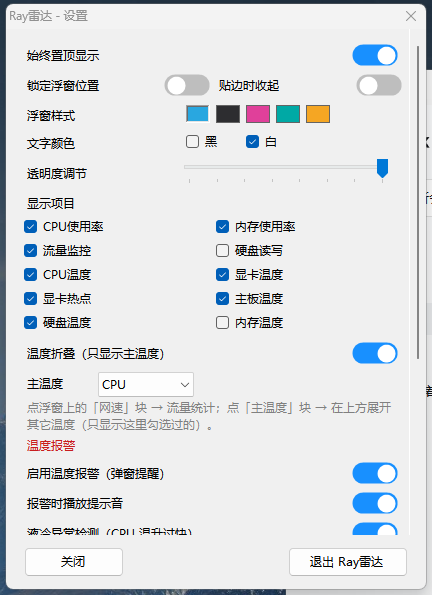
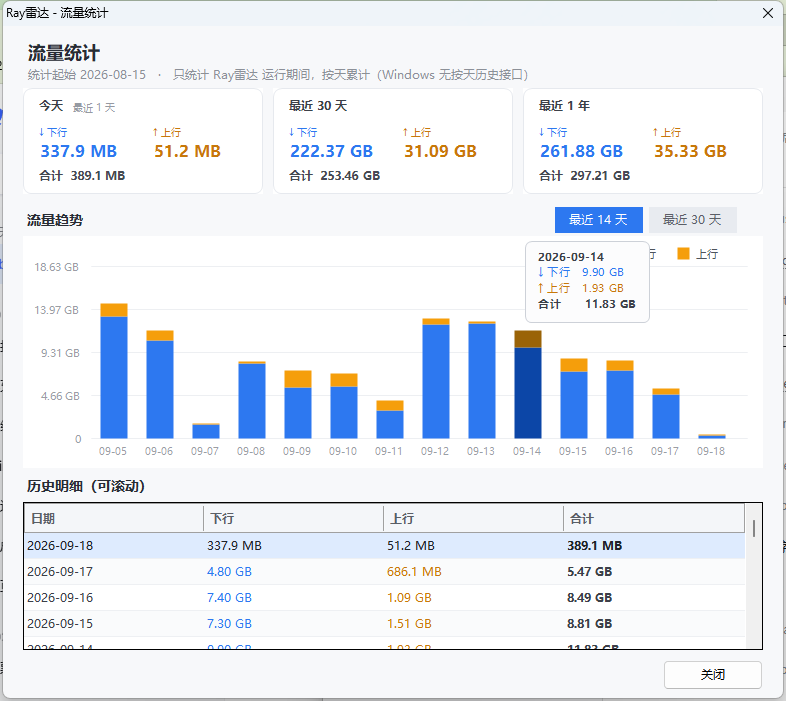

# Ray雷达 · RayRada

一个常驻 Windows 桌面的**硬件监控浮窗**：CPU 使用率 / 内存使用率 / 实时上下行网速 / **CPU·显卡·显卡热点·主板·硬盘温度**，温度超阈值或 CPU 温度短时间内飙升时**弹窗报警**（附带液冷/水冷排查提示）。

单文件、免安装、免运行库：一个 `RayRadar.exe` 走到哪都能跑。



## 特性

- **8 个显示块**（每块可单独开关）：`CPU%`、`内存%`、`↑上传 ↓下载`、`CPU温`、`显卡温`、`显卡热点`、`主板温`、`硬盘温`
- **温度折叠**：默认只显示一块「主温度」（默认 CPU，可在设置里换成显卡/热点/主板/硬盘/内存）。**点它就展开**浮窗上方的温度浮层，显示设置里勾选过的其它温度；再点收起，拖动时浮层跟随
- **点「网速」块看流量统计**：**卡片总览**（今天 / 最近 30 天 / 最近 1 年，蓝=下行 橙=上行）+ **堆叠柱状图**（悬停显示当天明细，可切换最近 14 / 30 天，Y 轴自动 KB/MB/GB）+ **可滚动的历史明细表**（斑马纹、表头固定，保留一整年）
- **温度报警**：6 项温度阈值 + **CPU 20 秒温升阈值**（水泵停转、水管渗漏、冷排风扇停转会表现为温度陡升），弹窗 + 提示音，同一项 5 分钟内只提醒一次
- **DSH 手机入口哨兵**（可选，默认开）：盯着本机 **3081 端口转发**（DSH 手机网页入口）上的连接，**白名单之外**的设备一连上就提示音 + 弹窗 + **删掉转发并切断它的连接**；没有这个转发的电脑上等于不做事（见下）
- **单文件 exe**：LibreHardwareMonitor 及其 27 个依赖 DLL 全部嵌在 exe 内，运行时自解压加载，不需要装 .NET SDK、不需要附带 DLL
- **一次点击的部署**：exe 自带「需要管理员」清单 → 双击弹一次 UAC；首次运行自动注册**登录计划任务（最高权限）**，之后开机自动启动且**不再弹 UAC**
- 始终置顶、锁定位置、贴边吸附（零边距，按工作区计算不会藏到任务栏后面）、5 套配色、文字黑/白、透明度、位置记忆、单实例
- **右键**浮窗打开设置窗口（双击不再触发，避免误触）；`RayRadar.exe /settings` 可直接启动到设置
- 设置存 `%APPDATA%\RayRadar\settings.ini`，卸载时删掉它和计划任务就干净了

## 截图

| 报警弹窗 | 流量统计 | 设置窗口 |
|---|---|---|
|  |  |  |

流量统计窗口的柱状图支持悬停查看当天明细：



> 截图中的历史数据为**演示数据**（真实使用时从你首次运行那天开始逐日累积）。
> 流量统计只统计 **Ray雷达 运行期间**的流量——Windows 自身不提供按天的历史流量（历史上网量在 SRUM 的 ESE 数据库里，读取需管理员且要解析 ESE，本项目不做）。

## 下载与使用

1. 到 [Releases](https://github.com/york626/RayRada/releases) 下载 `RayRadar.exe`
2. 双击 → Windows 弹「用户账户控制」→ 点「是」
   - CPU / 主板 / 硬盘 / 内存温度必须提权才能读（显卡温度不需要），所以程序固定以管理员运行
   - 若提示「Windows 已保护你的电脑」，点「更多信息 → 仍要运行」（exe 未做代码签名）
3. 首次运行若检测不到温度驱动，会询问是否安装 **PawnIO**（见下）——点「是」即可，安装包从官方发布页下载，只此一次
4. 完事。程序会自己建好登录计划任务，下次开机自动出现

## 温度是怎么来的

| 项 | 数据来源 |
|---|---|
| CPU 使用率 | `kernel32!GetSystemTimes` 差值 |
| 内存使用率 | `GlobalMemoryStatusEx().dwMemoryLoad` |
| 网速 | `NetworkInterface.GetIPv4Statistics()` 差值（排除回环 / WFP / QoS） |
| 硬盘读写 | 性能计数器 `PhysicalDisk` |
| 各温度 | **LibreHardwareMonitor 0.9.6** |

温度需要内核级访问：本项目使用 **PawnIO**（[namazso/PawnIO](https://github.com/namazso/PawnIO)，**GPL-2.0**，已签名的开源驱动）。
**出于许可证考虑，PawnIO 的安装包不打包在本项目的 exe 与 Release 里**，而是首次使用时由程序从官方发布页下载（`namazso/PawnIO.Setup` 的 latest release），或直接使用放在 exe 同目录下的 `PawnIO_setup.exe`（可离线部署）。

> 本项目**不使用** WinRing0 —— 那个驱动已被微软列入易受攻击驱动黑名单，杀毒软件也会查杀它。PawnIO 是它的合法替代品（有正规代码签名）。

显示 `—` 表示读不到：没提权，或缺 PawnIO 驱动。设置窗口底部会显示驱动状态，并提供「安装/重装温度驱动」按钮。

## 从源码编译

```powershell
# 1) 取依赖（下载 LibreHardwareMonitor 官方发布包，把 DLL 解到 lib\）
powershell -ExecutionPolicy Bypass -File .\获取依赖.ps1
# 2) 编译（用 Windows 自带的 csc.exe，无需 Visual Studio）
.\编译.cmd
```

- 编译器是 `%SystemRoot%\Microsoft.NET\Framework64\v4.0.30319\csc.exe`（**C# 5**）：源码里不能用字符串插值、`?.`、`nameof` 等新语法
- 编译时会把 `lib\*.dll` 逐个 `/resource:` 嵌进 exe；运行时由 `AppDomain.CurrentDomain.AssemblyResolve` 从自身资源流加载（注册必须在碰到任何 LHM 类型之前）
- 资源名必须等于 DLL 文件名，否则解析不到

## 目录结构

```
RayRadar.cs                  主程序源码（单文件，含全部类）
RayRadar.manifest            应用清单：requireAdministrator
RayRadar.ico                 图标
build.ps1 / 编译.cmd         编译脚本
获取依赖.ps1                 下载 LibreHardwareMonitor 依赖到 lib\
lib\                         编译依赖 DLL（不入库，用 获取依赖.ps1 生成）
screenshots\                 README 用的截图
THIRD-PARTY-NOTICES.md       第三方组件与许可证
CHANGELOG.md                 版本与更新备注
```

## 命令行参数

| 参数 | 作用 |
|---|---|
| `/settings` | 启动后直接打开设置窗口 |
| `/getdriver` | 只下载温度驱动安装包到 `%TEMP%` 并写日志，不安装（排查用） |

## DSH 手机入口哨兵（可选功能）

给 **DSH（DeepSeek Harness）手机网页入口**加一道门。DSH 的手机入口是 `netsh portproxy` 把 `本机内网IP:3081` 转发到 `127.0.0.1:3082`，
**谁能连上这个端口，就等于拿到这台电脑的完整控制权**（能跑 PowerShell）。本程序会：

- 每 **500 毫秒**检查该端口上的连接（跑在后台线程，不占界面线程、不卡浮窗）；
- **白名单之外**的设备一连上 ⇒ 提示音 + 置顶弹窗 + **删除那条端口转发** + **切断它已建立的 TCP 连接**（实测拦截耗时 **0.32 秒**）；
- 弹窗上两个按钮：**「重开手机入口」**（只把入口开回来，陌生设备照样被拦）／**「保持关闭」**（回车默认键，防误触）；
- 设置窗口里有白名单（**IP 或 MAC 都认**，逗号/空格分隔）与 **「加入上次拦截」** 按钮（自家设备被误拦时一键加白）。

| 项 | 说明 |
|---|---|
| 前提 | **只在本机确实存在 3081 端口转发时才工作**；没有这个转发的电脑上等于不做事 ⇒ 默认开启是安全的 |
| 日志 | `%APPDATA%\RayRadar\sentinel.log`（时间 / IP / MAC / 处置） |
| 免 UAC | 程序本身就以管理员运行，开/关入口、删转发都**不需要额外提权** |
| 已知局限 | 500 毫秒轮询**不是零窗口**：对方可能已经把页面加载出来；若它本地还留着登录 cookie，甚至能点到界面（cookie 是客户端凭据，程序管不到） |

> 该功能 2026-09-20 从独立的 PowerShell 哨兵整合进来（v4.10 起），并在 v4.14 把拦截耗时从约 3 秒压到 **0.32 秒**、弹窗改为非模态。

## 已知限制

- CPU / 主板 / 硬盘 / 内存温度需要**管理员权限 + PawnIO**；不满足时对应块显示 `—`
- **流量统计从首次运行当天开始累计**，且只统计程序运行期间；换网卡/重连导致的计数归零会自动忽略
- 内存温度（DIMM）默认关闭：需要内存条自带温度传感器，很多平台读不到
- 部分笔记本 / 品牌机的传感器名称不同，可能读不到主板或硬盘温度
- 显卡温度支持 NVIDIA（NVML）与 AMD（ADL）；其它厂商可能读不到
- exe 未做代码签名，首次运行可能出现 SmartScreen 提示

## 许可

本项目源码使用 [MIT 许可证](LICENSE)。第三方组件的许可证见 [THIRD-PARTY-NOTICES.md](THIRD-PARTY-NOTICES.md)。

本项目与 Raycast、Ray 分布式框架等任何同名项目无关，仅为个人自用的 Windows 桌面小工具。
